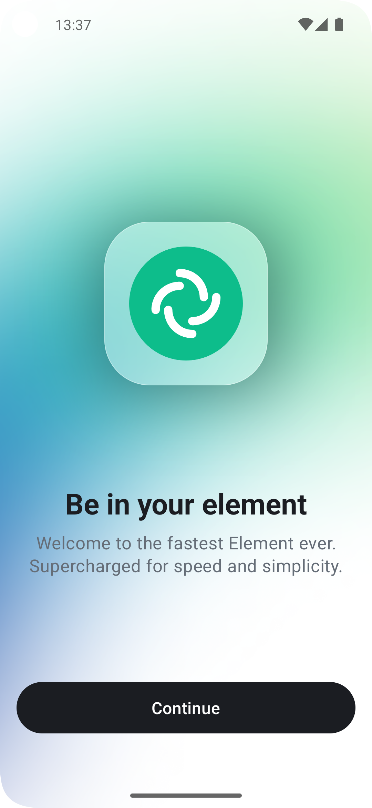
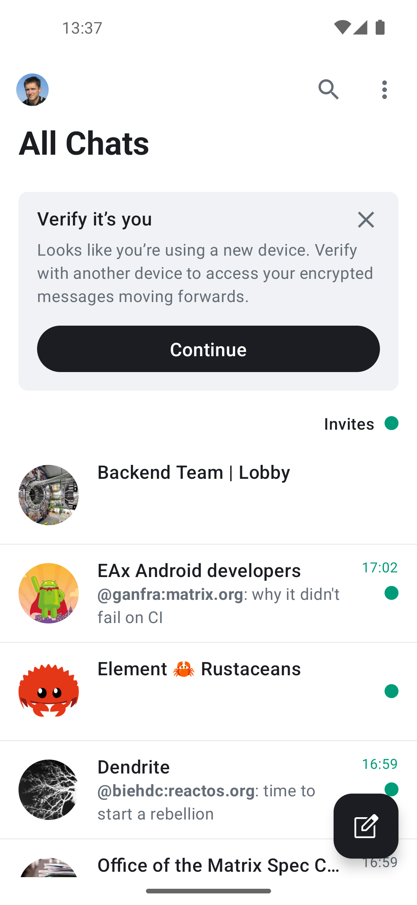
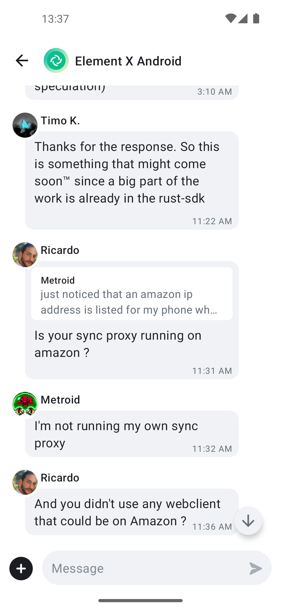
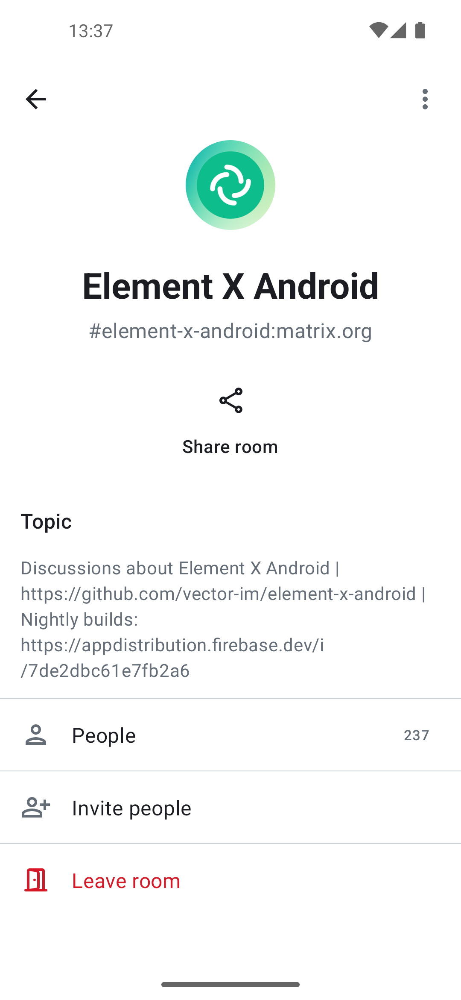
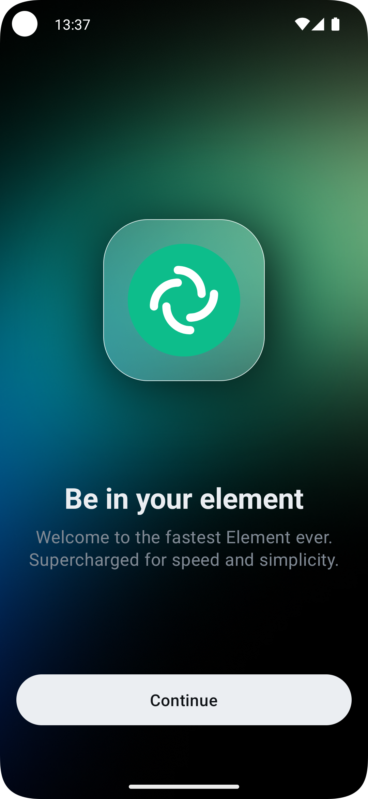
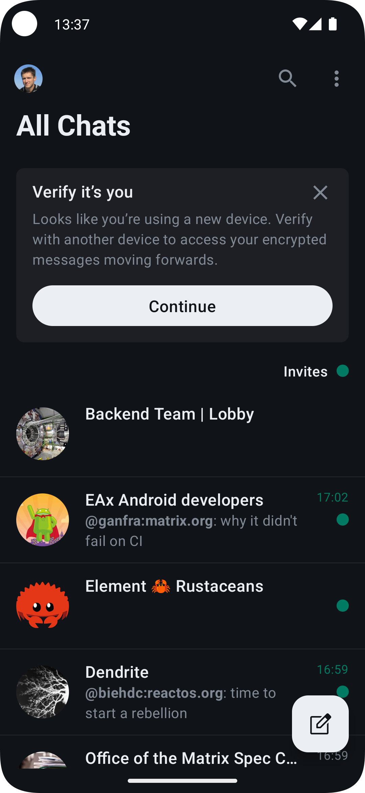
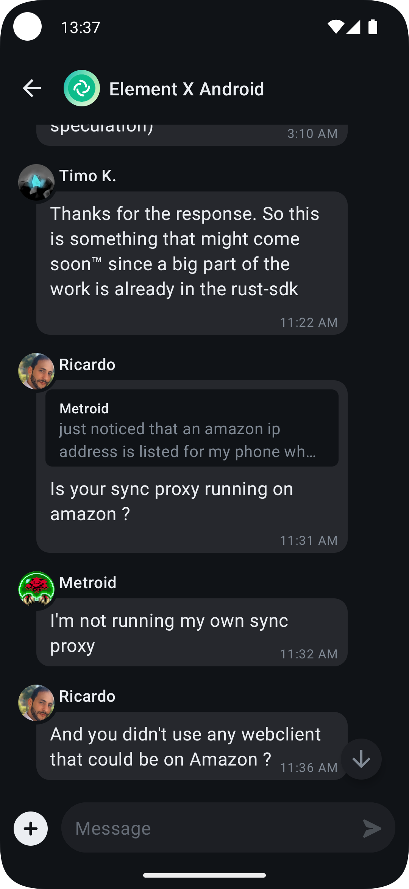
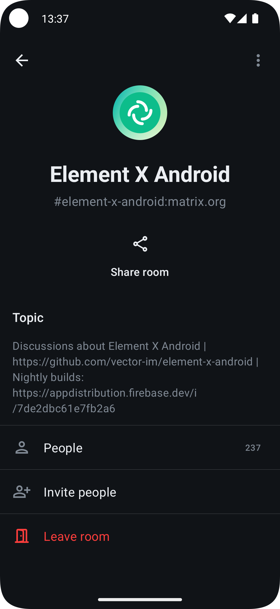

# WhatsApp Clone X Android

A production-grade, real-time messaging platform built to handle **4,000+ concurrent users**. This project is a fully functional WhatsApp-style messaging application for Android, built on top of the [Matrix](https://matrix.org/) protocol using the [Matrix Rust SDK](https://github.com/matrix-org/matrix-rust-sdk).

The UI is built entirely with [Jetpack Compose](https://developer.android.com/jetpack/compose), navigation is powered by [Appyx](https://github.com/bumble-tech/appyx), and state management uses [Molecule](https://github.com/cashapp/molecule) Presenters. The app targets Android 7.0+ (API 24).

---

## Features

- **Real-time messaging** — Send and receive messages instantly via the Matrix protocol
- **End-to-end encryption** — Secure conversations powered by the Matrix Rust SDK
- **Media sharing** — Share images, videos, files, and location
- **Voice & video calls** — Integrated calling support
- **Group chats** — Create and manage group conversations
- **Read receipts & typing indicators** — Real-time status updates
- **Push notifications** — Stay notified even when the app is in the background
- **Dark & light themes** — Full theme support with Material 3 / Compound design system
- **Offline support** — Local caching for seamless offline experience
- **Scalable architecture** — Designed and tested to support 4,000+ concurrent users

---

## Screenshots

|||||
|-|-|-|-|
|||||

---

## Tech Stack

| Layer | Technology |
|:------|:-----------|
| **Language** | Kotlin |
| **UI** | Jetpack Compose |
| **Navigation** | Appyx |
| **State Management** | Molecule Presenters |
| **Networking / SDK** | Matrix Rust SDK (via FFI) |
| **Dependency Injection** | Metro |
| **Design System** | Compound (Material 3) |
| **Async** | Kotlin Coroutines & Flow |
| **Testing** | JUnit, Turbine, Screenshot tests |
| **Build System** | Gradle (Kotlin DSL) |

---

## Architecture

The app follows a modular, multi-module architecture:

```
app/              → Application entry point
appnav/           → Top-level navigation graph
features/         → Feature modules (messages, login, calls, etc.)
  ├── api/        → Public interfaces and data classes
  ├── impl/       → Implementation, Presenter, and View
  └── test/       → Test fakes and utilities
libraries/        → Shared libraries (matrix, design system, media, etc.)
```

Each screen follows the **Node → Presenter → View** pattern:

| File | Purpose |
|:-----|:--------|
| `FooNode.kt` | Appyx Node — handles navigation, wires Presenter to View |
| `FooPresenter.kt` | Composable function that produces `FooState` from `FooEvent`s |
| `FooView.kt` | Stateless Composable rendering UI from `FooState` |
| `FooState.kt` | Immutable data class representing UI state |
| `FooEvent.kt` | Sealed interface for UI actions |

---

## Getting Started

### Prerequisites

- **Android Studio** Hedgehog or later
- **JDK 17+**
- **Android SDK** with API 24+ installed

### Build & Run

```bash
# Clone the repository
git clone https://github.com/rahulsingh/whatsapp-clone-x-android.git
cd whatsapp-clone-x-android

# Build the debug APK
./gradlew assembleDebug

# Run unit tests
./gradlew test

# Lint check
./gradlew lint

# Format code
./gradlew ktlintFormat
```

Open the project in Android Studio and select the `app` run configuration to build and run on a device or emulator.

---

## Project Structure

```
whatsapp-clone-x-android/
├── app/                    # Main application module
├── appnav/                 # Navigation graph
├── features/
│   ├── messages/           # Chat / messaging screen
│   ├── login/              # Authentication flow
│   ├── call/               # Voice & video calls
│   ├── createroom/         # New chat / group creation
│   ├── home/               # Home screen with chat list
│   ├── userprofile/        # User profile screen
│   ├── roomdetails/        # Chat details / settings
│   ├── share/              # Share content to chats
│   ├── location/           # Location sharing
│   ├── poll/               # Polls in chats
│   └── ...                 # Other feature modules
├── libraries/
│   ├── matrix/             # Matrix SDK wrapper
│   ├── designsystem/       # Design tokens & components
│   ├── compound/           # Compound design system
│   ├── push/               # Push notification handling
│   ├── mediaplayer/        # Audio/video playback
│   ├── cryptography/       # E2EE utilities
│   └── ...                 # Other shared libraries
├── gradle/                 # Gradle wrapper & version catalog
└── docs/                   # Documentation
```

---

## Contributing

Contributions are welcome! Feel free to open issues or submit pull requests.

1. Fork the repository
2. Create your feature branch (`git checkout -b feature/amazing-feature`)
3. Commit your changes (`git commit -m 'Add amazing feature'`)
4. Push to the branch (`git push origin feature/amazing-feature`)
5. Open a Pull Request

---

## License

This project is licensed under the **MIT License** — see the [LICENSE](LICENSE) file for details.

```
MIT License

Copyright (c) 2025 Rahul Singh
```

---

## Acknowledgements

This project is built on top of and inspired by [Element X Android](https://github.com/element-hq/element-x-android) by Element, leveraging the [Matrix Rust SDK](https://github.com/matrix-org/matrix-rust-sdk) for real-time, secure communication.

---

**Built with** Kotlin, Jetpack Compose & Matrix
